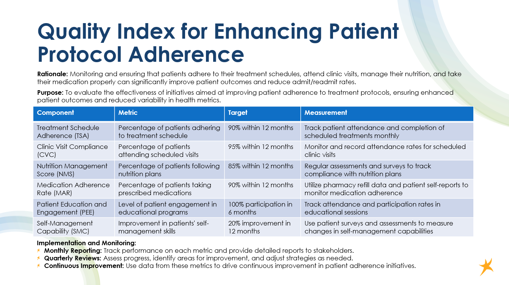

# Data Analyst

#### Programming Languages & Tools: Python (Pandas, NumPy, Matplotlib, Seaborn), R, VBA, SQL
#### Data Visualization & BI Tools: Tableau, Power BI, Excel (Pivot Tables, VLOOKUP), Visual Studio
#### Database Management: MySQL, MS SQL Server
#### Data Analysis & Workflow Tools: Alteryx, JMP, PowerPivot, Zendesk
#### Certifications: Microsoft Office Specialist – Excel, Word, Powerpoint

## Education		        		
- B.S. in Business Administration | University of Dener (_June 2024_)

## Projects
### Client Sentiment & Market Volatility Dashboard — Capstone with Charles Schwab

## Healthcare Utilization Analytics & Quality Improvement — DaVita Case Study

